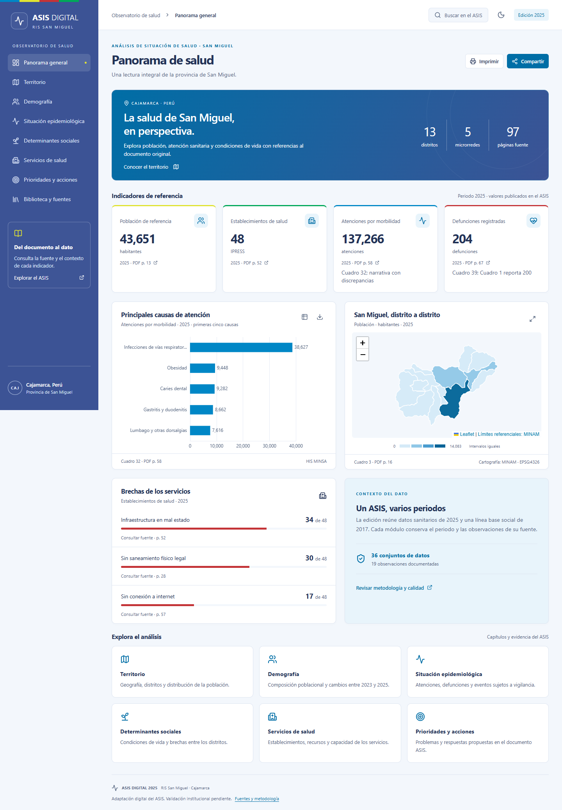
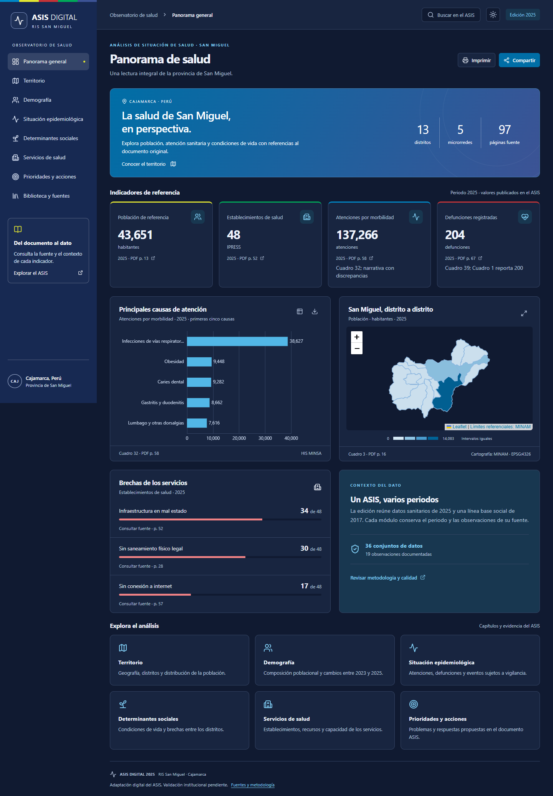
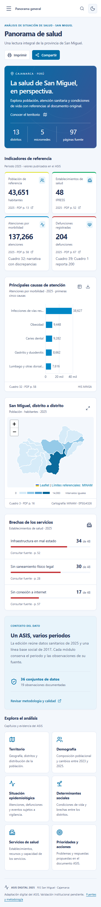

# Diseño visual y prototipo implementado

El prototipo es la propia aplicación navegable: tablero principal, menú lateral, ocho capítulos y biblioteca. Las capturas de referencia muestran el diseño de escritorio, móvil y modo oscuro.

## Sistema visual

Paleta institucional tomada del emblema DIRESA Cajamarca aportado por el propietario: azul #0087C6, índigo #3C5395, verde #00A859, rojo #C43438 y amarillo #E0E332. Navegación índigo, portada azul, fondos claros y acentos secundarios discretos. El azul de botones/enlaces se oscurece a #006EA6 para asegurar contraste con texto blanco. Verde/rojo distinguen estados de servicios, con leyendas textuales; amarillo se usa en detalles decorativos. El modo oscuro mantiene la identidad con azules profundos y acentos claros. Los colores de estado incorporan texto: ninguna alerta depende solo del color.

Tipografía del sistema, sin descarga remota; cifras alineadas, jerarquía de títulos y etiquetas de fuente. Tarjetas muestran valor, unidad, año, página y advertencia cuando corresponde. Los gráficos disponen de tabla alternativa y exportación PNG con título y procedencia. Las tablas permiten búsqueda, ordenación y CSV compatible con Excel.

La navegación lateral se convierte en menú móvil. Búsqueda mediante diálogo con foco y Escape; botones con nombres accesibles; movimiento reducido respetado. Las transiciones son breves; los contadores solo muestran valores documentados. Impresión elimina controles y conserva el contenido.

## Cartografía

Leaflet utiliza polígonos distritales del servicio oficial MINAM en EPSG:4326. Los mapas temáticos incluyen población 2025, agua/pobreza 2017 e infraestructura 2025. No se generan ubicaciones de IPRESS. Los mapas/fotografías de clima y altitud del ASIS permanecen consultables en el PDF e índice, con su condición de imagen original.

El prototipo no sustituye la validación institucional de las cifras. La identidad usa un símbolo propio de salud; no afirma aprobación ni reproduce firmas institucionales.
